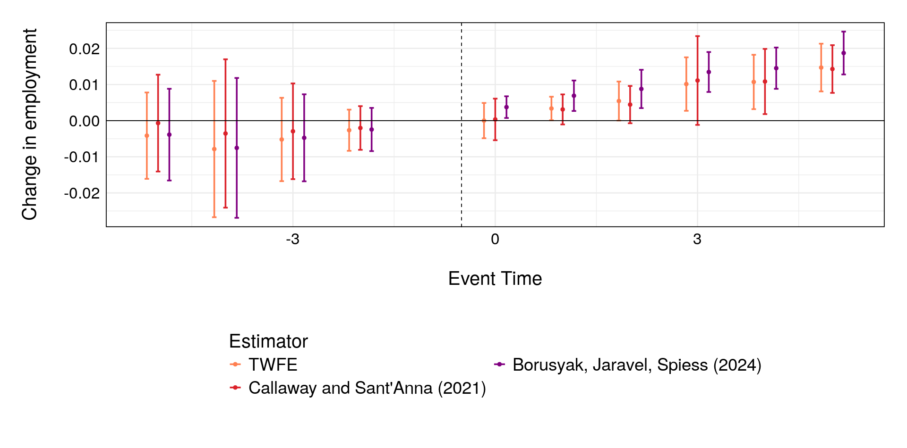
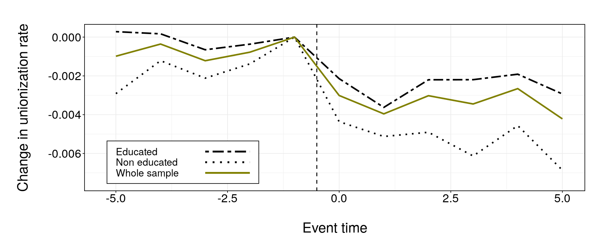

<br />
<div align="center">
   
  <h3 align="center">Right-to-Work Laws and Labor Market Dynamics: </h3>     
  <h3 align="center">Insights from the Recent Adoption Wave</h3>
  
  <p align="center">
    Master's thesis
  </p>
  
  <br />

  <a>
    
  </a>
</div>
<br />


[![LinkedIn][linkedin-shield]][linkedin-url]

## Table of Contents 📜
- [About the Project](#about-the-project-)
  - [Built with](#built-with-)
  - [Project Structure](#project-structure-)
- [Using `renv` for Reproducibility](#using-renv-for-reproducibility-)
- [Obtaining Data](#obtaining-data-)
- [License](#license-)
- [Acknowledgements](#acknowledgements-)
- [Contact](#contact-)

<a name="about-the-project"></a>
## About the Project 📌

This repository hosts the source files for my Master's thesis as part of the [M2 Analysis and Policy in Economics program](https://www.parisschoolofeconomics.eu/en/teaching/masters-program/ape-analysis-policy-in-economics/) at the Paris School of Economics. Under the supervision of [David Margolis](https://www.parisschoolofeconomics.eu/fr/margolis-david/), this study explores the effects of right-to-work laws on unionization, wages, and employment, using a staggered Differences-in-Differences framework.

> This thesis examines the impact of right-to-work (RTW) laws on unionization rate, wages, and employment by leveraging data from the resurgence of these laws in five states over the past fifteen years. Using an event study design with staggered adoption, we find that RTW laws lead to a significant and immediate decline in unionization rate and a gradual increase in employment levels. However, our analysis does not provide evidence of any significant impact on hourly wages. We further strengthen our assessment by employing heterogeneity-robust estimators and assessing the sensitivity of our findings to potential violations of the common trends assumption. Finally, we demonstrate that the impact of RTW laws is not homogeneous across all workers. Less educated workers are most likely to leave unions, while highly unionized industries experience the largest declines in union membership.



<a name="built-with"></a>
### Built with 🔨

* [R](https://www.r-project.org/)
* [renv](https://rstudio.github.io/renv/)
* [ipumsr](https://tech.popdata.org/ipumsr/)
* [git lfs](https://git-lfs.com/)
* [fixest](https://lrberge.github.io/fixest/)
* [twowayfeweights](https://github.com/chaisemartinPackages/twowayfeweights)
* [did](https://github.com/bcallaway11/did)
* [didimputation](https://github.com/kylebutts/didimputation)
* [HonestDiD](https://github.com/asheshrambachan/HonestDiD)

### Project Structure 📂

The repository is organized into various scripts and directories to streamline the research process:

- **Scripts:**
  - `1_init_environment.R`: Initializes the R environment and loads necessary packages.
  - `2_import_and_process_data.R`: Manages data importation and preliminary processing.
  - `3_generate_descriptive_statistics.R`: Summarizes dataset characteristics through descriptive statistics.
  - `4_heckman_selection_model.R`: Applies sample selection correction using the Heckman model.
  - `5_conduct_event_studies.R`: Estimates RTW law impact with traditional TWFE estimators.
  - `6_use_frisch_waugh_theorem.R`: Applies Frisch-Waugh theorem to estimate regression coefficients, controlling for other variables.
  - `7_apply_robust_estimators.R`: Uses heterogeneity-robust estimators.
  - `8_test_parallel_trend_sensitivity.R`: Tests the sensitivity of results to the parallel trend assumption.
  - `9_perform_other_sensitivity_analysis.R`: Estimates RTW law impact on specific groups.

- **Modules, data, and outputs:**
  - `data/`: Contains quality flags for earnings data.
  - `modules/`: Contains reusable functions for scripts.
  - `outputs/`: Contains plots and tables generated by scripts.
  
- **Final document:**
  - `thesis.pdf`: Fully edited master thesis.
  
- **Other files:**
  - `renv.lock`: Generated by renv, contains R package dependencies for the project.

<a name="using-renv-for-reproducibility"></a>
## Using `renv` for Reproducibility 🤝

Ensure consistency and reproducibility of the R environment with `renv`. To set up the environment, clone the repository and execute the following in your R console:

```r
# Install 'renv' if it's not already installed:
# install.packages("renv")

library(renv)
renv::activate()
renv::restore()
```

This will install the packages specified in the `renv.lock` file.



<a name="obtaining-data"></a>
## Obtaining Data 📊

The data for this thesis is obtained through the IPUMS CPS (Current Population Survey) API. To access the data, you need to generate an API key from the [IPUMS CPS website](https://cps.ipums.org/cps/). Once you have the API key, you can use it in the R scripts to fetch the data.

> Sarah Flood, Miriam King, Renae Rodgers, Steven Ruggles, J. Robert Warren and
Michael Westberry. Integrated Public Use Microdata Series, Current Population
Survey: Version 10.0 [dataset]. Minneapolis, MN: IPUMS, 2022.
https://doi.org/10.18128/D030.V10.0

Additionally, this project uses Git Large File Storage (LFS) to manage large data files not available through the API, such as `quality_flags.parquet`. To ensure that you can access the exact data used in this project, please follow these steps:

```bash
# Ensure Git LFS is installed on your system
git lfs install

# Pull large files with Git LFS
git lfs pull
```

<a name="license"></a>
## License 🔒

This work is shared under the Creative Commons Attribution 4.0 International License. Refer to `LICENSE.txt` for more details.

<a name="acknowledgements"></a>
## Acknowledgements 😊

I would like to extend my heartfelt gratitude to David Margolis for his invaluable assistance and availability during the writing of this master's thesis. His guidance and support were instrumental in shaping the direction of my work. Any errors or oversights in this thesis are entirely my own.

<a name="contact"></a>
## Contact 📞

For any inquiries, feel free to reach out:

Julien Peignon - [Email](mailto:julien.peignon@ens-paris-saclay.fr) - [GitHub](https://github.com/JulienPeignon) - [LinkedIn](https://linkedin.com/in/julien-peignon/)


[linkedin-shield]: https://img.shields.io/badge/-LinkedIn-black.svg?style=for-the-badge&logo=linkedin&colorB=555
[linkedin-url]: https://linkedin.com/in/julien-peignon/
